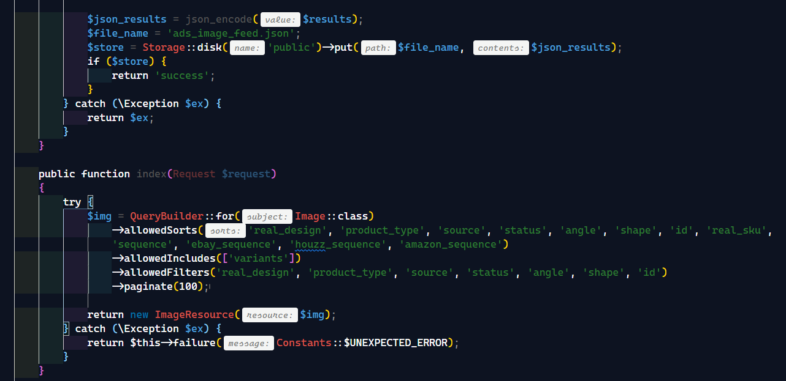
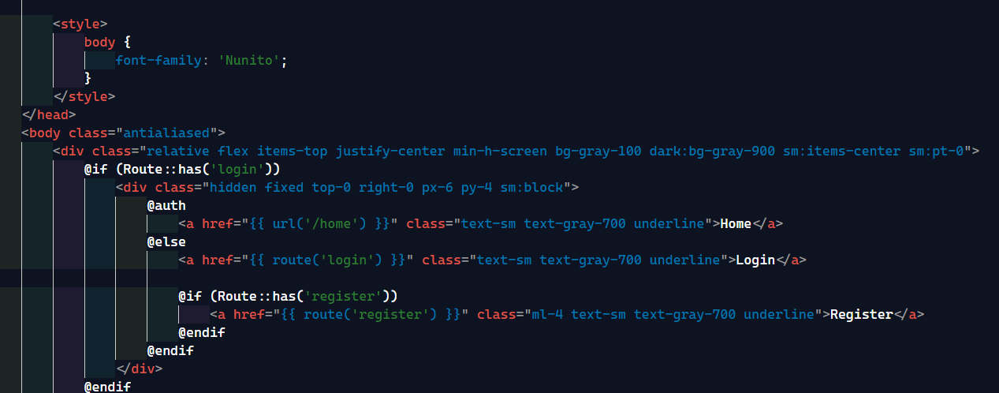
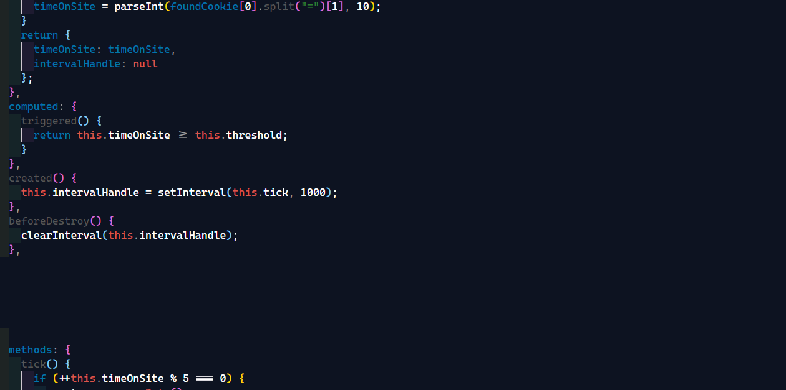
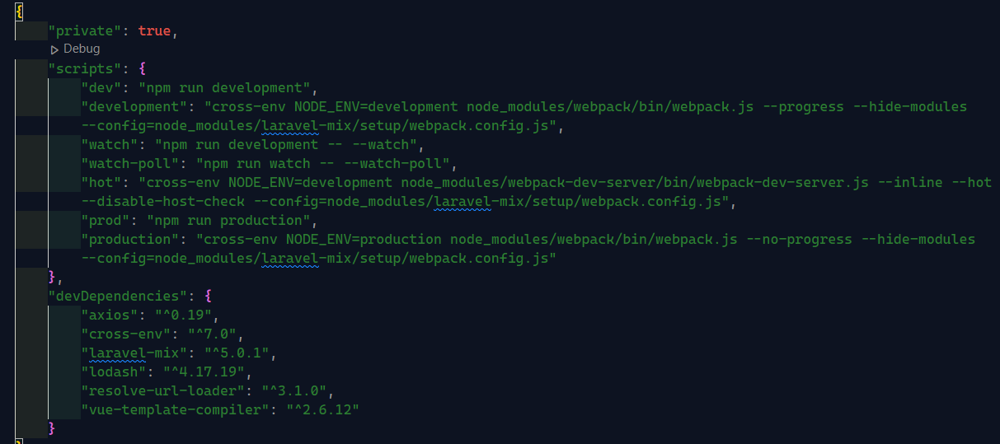

# Laradark VsCode Semantic Color Theme

## Screenshots

### PHP

### Blade

### Vue

### JSON

## Main Focus
Projects main focus is highlighting syntax according to Laravel Core concepts.It's making  the code more readable and easy to understand.

Laravel is a Color Theme for Visual Studio Code forked from Michael Dyrynda original theme for sublime text. It is inspired by the syntax highlighting found in the official [Laravel documentation](https://laravel.com/docs).

## Installation

### Visual Studio Code Marketplace

You can install this awesome theme through the [Visual Studio Code Marketplace](https://marketplace.visualstudio.com/items?itemName=erenkucukersoftware.laravel).

## Supported languages

This color scheme ought to work with any language in Visual Studio Code, it has been specifically built and tested against languages common to development with Laravel.

* PHP
* MySQL
* HTML/Blade
* JavaScript/Vue
* CSS/Sass/SCSS/Less
* JSON
* XML
* Markdown
* Diff

## About

ReCreated by [Eren Küçüker](https://twitter.com/yerenkucuker).

Thanks to [Michael Dyrynda](https://twitter.com/michaeldyrynda) for the [Sublime Text 3](https://github.com/michaeldyrynda/Laravel.tmTheme) adaptation and [Taylor Otwell](https://twitter.com/taylorotwell) for creating the framework.